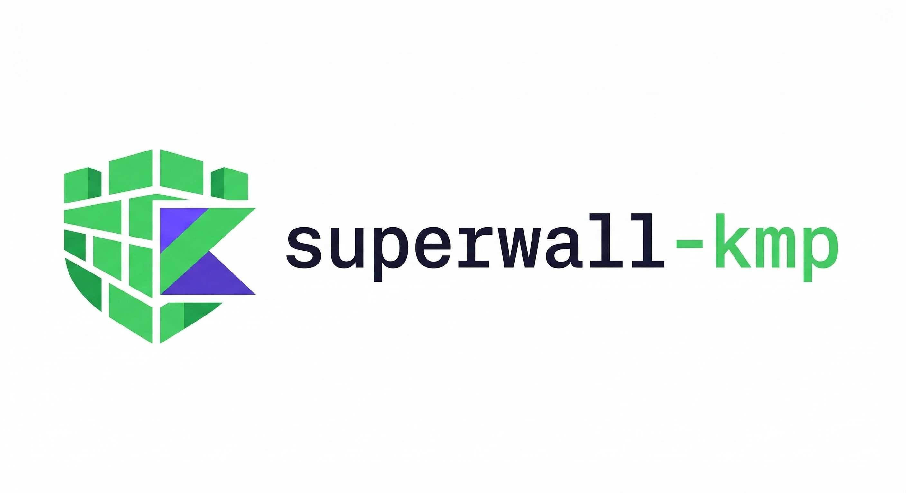
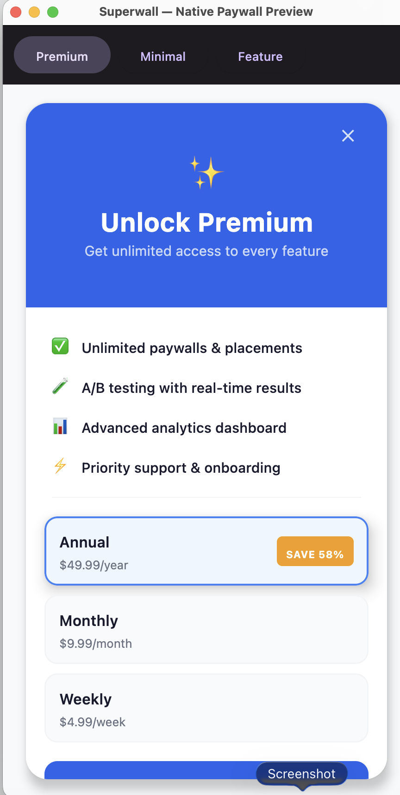

<p align="center">
  
</p>

<p align="center">
  
  
  
  
  
</p>

# Superwall KMP

Kotlin Multiplatform SDK for [Superwall](https://superwall.com) — remote paywall configuration, A/B testing, and subscription management from a single codebase.

## Features

- **Server-Driven Native UI** — Backend sends a JSON component tree, SDK renders native Compose paywalls. No WebView needed.
- **Shared Business Logic** — Config management, identity, analytics, placement evaluation, and expression engine run in `commonMain`
- **Dual Rendering** — Native Compose renderer (new) + WebView fallback (Android/iOS) with full JavaScript bridge support
- **Platform-Native Billing** — Google Play Billing on Android, StoreKit on iOS
- **Koin DI** — Module-scoped dependency injection with platform bindings swapped at init
- **Compose Multiplatform** — `SuperwallPaywall`, `SuperwallGate`, and `SuperwallNativePaywall` composables
- **Expression Evaluator** — Tokenizer + recursive descent parser for server-side trigger rule evaluation

## Server-Driven Native Paywall

<p align="center">
  
</p>

The backend defines the entire paywall UI as a JSON component tree — the SDK renders it as **native Material 3 composables** across all platforms. No WebView, no HTML, no CSS.

### How It Works

```
Backend JSON                          Native UI
─────────────                         ─────────
{ "type": "stack",                    Column {
  "dimension": "vertical",      →       Text("Unlock Premium")
  "components": [                       PackageSelector(...)
    { "type": "text", ... },            Button("Start Free Trial")
    { "type": "package", ... },       }
    { "type": "purchase_button" }
  ]
}
```

### 11 Component Types

| Component | Renders As | Purpose |
|-----------|-----------|---------|
| `stack` | Column / Row / Box | Layout container (vertical, horizontal, z-layer) |
| `text` | Material 3 Text | With `{{ product.price }}` variable resolution |
| `image` | Platform image loader | Remote URL or local asset |
| `button` | Clickable Box | Fires actions (close, open-url, custom) |
| `purchase_button` | Clickable Box | Triggers purchase flow |
| `package` | Selectable card | Product option with animated selection style |
| `spacer` | Spacer | Flexible or fixed spacing |
| `divider` | HorizontalDivider | Thin separator line |
| `close_button` | Icon button | Dismisses the paywall |
| `badge` | Styled label | "BEST VALUE", "SAVE 58%", etc. |
| `icon` | Icon or symbol | Named icon or URL |

### Variable Templates

```
{{ product.price }}          → $49.99
{{ product.period }}         → year
{{ product.trial_days }}     → 14
{{ product.price_per_month }} → USD 4.16
{{ product.name }}           → Yearly
```

### Drop-In Integration

```kotlin
// Place at your app root — auto-presents native paywalls
Box {
  MyApp()
  SuperwallNativePaywall()
}
```

When `componentsConfig` is present in the backend response, the SDK renders natively. When absent, it falls back to WebView — fully backwards compatible.

## Targets

| Platform | Target | Billing | Rendering |
|----------|--------|---------|-----------|
| Android | `androidTarget` | Google Play Billing 7.1 | Native Compose + WebView fallback |
| iOS | `iosArm64`, `iosX64`, `iosSimulatorArm64` | StoreKit 1 | Native Compose + WKWebView fallback |
| macOS | `macosArm64`, `macosX64` | — | Native Compose |
| Desktop | `jvm("desktop")` | — | Native Compose |

## Setup

### Android

```kotlin
// build.gradle.kts
dependencies {
  implementation("io.github.androidpoet:superwall:0.2.0")
  implementation("io.github.androidpoet:superwall-compose:0.2.0") // native renderer
}
```

```kotlin
// Application.onCreate
Superwall.configure(
  apiKey = "pk_...",
  platformModule = superwallAndroidModule(
    context = applicationContext,
    activityProvider = { currentActivity },
  ),
)
```

### iOS

```kotlin
// Shared Kotlin
Superwall.configure(
  apiKey = "pk_...",
  platformModule = superwallIOSModule,
)
```

```swift
// Swift via Kotlin interop
SuperwallCompanion.shared.configure(
  apiKey: "pk_...",
  platformModule: IOSModuleKt.superwallIOSModule
)
```

## Usage

### Register Placements

```kotlin
Superwall.instance.register("premium_feature") {
  // Feature unlocked — no paywall shown, or user purchased
}
```

### Identify Users

```kotlin
Superwall.instance.identify("user_123")
Superwall.instance.setUserAttributes(mapOf("plan" to "pro", "age" to 25))
```

### Subscription Status

```kotlin
Superwall.instance.setSubscriptionStatus(
  SubscriptionStatus.Active(entitlements = setOf(Entitlement("premium")))
)
```

### Compose Integration

```kotlin
// Gate content behind a paywall
SuperwallGate(placement = "premium_feature") {
  Text("This is premium content!")
}

// Or present manually
SuperwallPaywall(
  placement = "upgrade_prompt",
  onFeatureUnlocked = { /* navigate */ },
  onDismiss = { /* handle dismiss */ },
)
```

### Custom Purchase Controller

```kotlin
val controller = object : PurchaseController {
  override suspend fun purchase(product: StoreProduct): PurchaseResult {
    // Your RevenueCat / custom logic here
    return PurchaseResult.Purchased
  }

  override suspend fun restorePurchases(): RestorationResult {
    return RestorationResult.Restored
  }
}

Superwall.configure(
  apiKey = "pk_...",
  options = SuperwallOptions(purchaseController = controller),
  platformModule = superwallAndroidModule(context, activityProvider),
)
```

### Events

```kotlin
// Observe all SDK events
Superwall.instance.events.collect { eventInfo ->
  println("${eventInfo.event} at ${eventInfo.timestamp}")
}

// Or use the delegate
Superwall.instance.delegate = object : SuperwallDelegate {
  override fun handleSuperwallEvent(eventInfo: SuperwallEventInfo) { }
  override fun handleCustomPaywallAction(name: String) { }
  override fun subscriptionStatusDidChange(status: SubscriptionStatus) { }
}
```

## Architecture

```
superwall-kmp/
├── superwall/                        ← Core SDK (KMP)
│   ├── commonMain/                   ← Shared business logic
│   │   ├── Superwall.kt             ← Entry point
│   │   ├── models/                   ← Domain models
│   │   │   └── components/           ← Server-driven UI component model
│   │   │       ├── PaywallComponent  ← 11 sealed component types
│   │   │       ├── Styling           ← Colors, padding, borders, shadows
│   │   │       ├── Action            ← Purchase, close, restore, navigate
│   │   │       └── VariableResolver  ← {{ product.price }} template engine
│   │   ├── config/                   ← Remote config + caching
│   │   ├── identity/                 ← User identity + attributes
│   │   ├── analytics/                ← Event tracking + batching
│   │   ├── placement/                ← Trigger evaluation + expression engine
│   │   ├── network/                  ← Ktor API client
│   │   └── di/                       ← Koin core module
│   ├── androidMain/                  ← Android implementations
│   │   ├── billing/                  ← Google Play Billing
│   │   └── webview/                  ← WebView + JS bridge + Activity
│   └── iosMain/                      ← iOS implementations
│       ├── storekit/                 ← StoreKit 1
│       └── webview/                  ← WKWebView + message handlers
├── superwall-compose/                ← Compose Multiplatform UI
│   ├── PaywallComposable.kt         ← SuperwallPaywall, SuperwallGate
│   └── renderer/                     ← Server-driven native renderer
│       ├── ComponentRenderer         ← Recursive component → Compose mapper
│       ├── NativePaywall             ← Top-level rendering composable
│       ├── PaywallRenderState        ← Variable resolution + product state
│       └── SuperwallNativePaywall    ← Auto-presenting drop-in composable
├── desktop-sample/                   ← Desktop JVM sample (3 paywall designs)
└── app/                              ← Android sample
```

### DI (Koin)

```
superwallCoreModule        ← Shared: ConfigManager, IdentityManager, AnalyticsTracker, etc.
  + superwallAndroidModule ← Android: SharedPrefs, Play Billing, WebView
  OR superwallIOSModule    ← iOS: UserDefaults, StoreKit, WKWebView
```

## Tech Stack

| Layer | Library |
|-------|---------|
| DI | [Koin](https://insert-koin.io/) 4.0 |
| Networking | [Ktor](https://ktor.io/) 3.0 |
| Serialization | [kotlinx.serialization](https://github.com/Kotlin/kotlinx.serialization) 1.7 |
| Async | [kotlinx.coroutines](https://github.com/Kotlin/kotlinx.coroutines) 1.9 |
| Date/Time | [kotlinx-datetime](https://github.com/Kotlin/kotlinx-datetime) 0.6 |
| Build | Gradle 8.9, Kotlin 2.1.0, AGP 8.5.2 |
| Publishing | Maven Central via [vanniktech](https://github.com/vanniktech/gradle-maven-publish-plugin) |

## Build

```bash
# All targets
./gradlew build

# Android only
./gradlew :superwall:compileReleaseKotlinAndroid

# iOS only
./gradlew :superwall:compileKotlinIosArm64

# Desktop (JVM)
./gradlew :superwall:compileKotlinDesktop
```

## License

```
Copyright 2026 androidpoet (Ranbir Singh)

Licensed under the Apache License, Version 2.0 (the "License");
you may not use this file except in compliance with the License.
You may obtain a copy of the License at

   http://www.apache.org/licenses/LICENSE-2.0

Unless required by applicable law or agreed to in writing, software
distributed under the License is distributed on an "AS IS" BASIS,
WITHOUT WARRANTIES OR CONDITIONS OF ANY KIND, either express or implied.
See the License for the specific language governing permissions and
limitations under the License.
```
